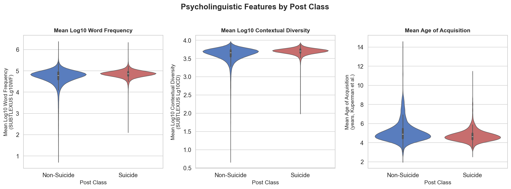
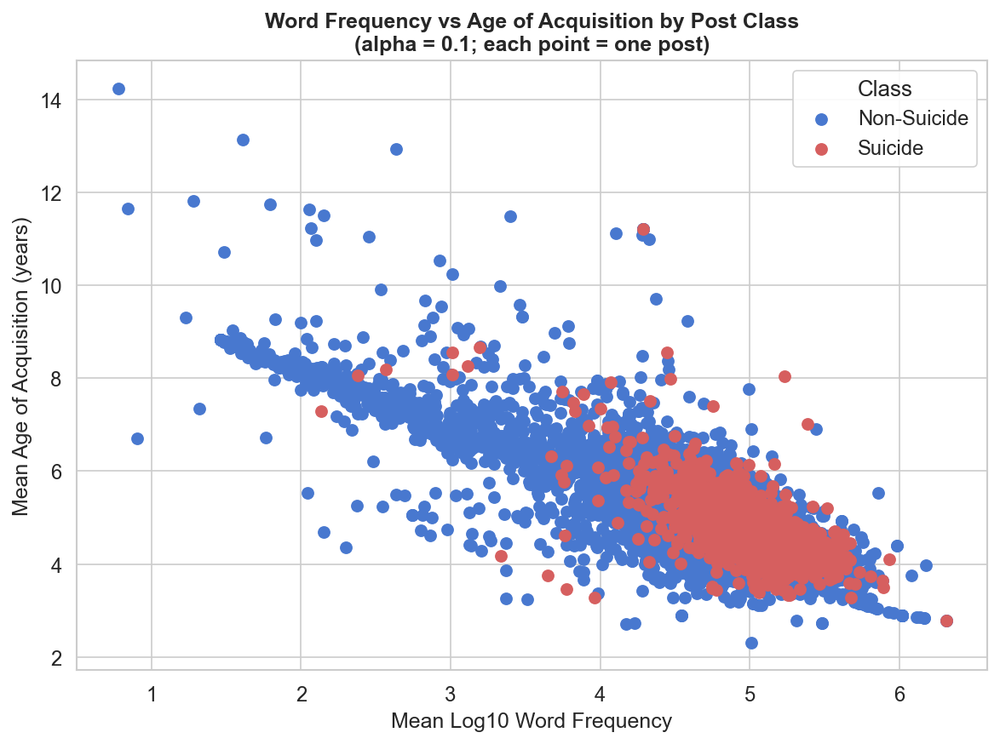
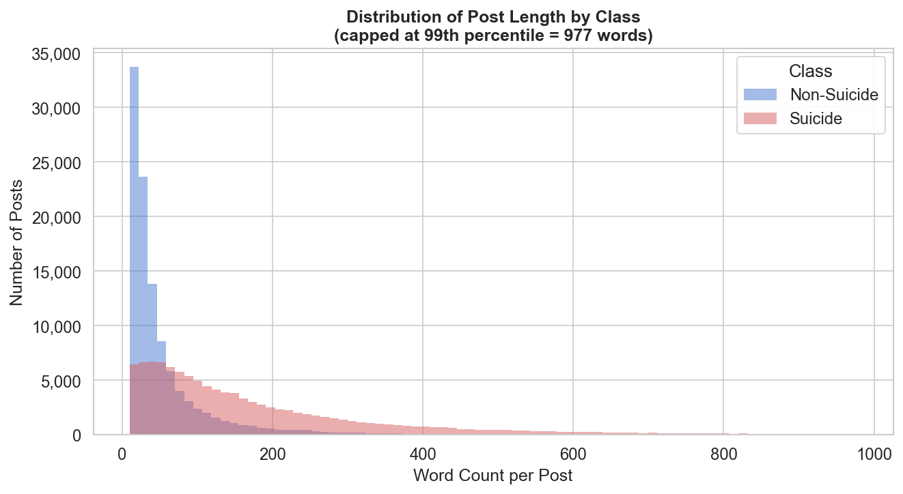

# Psycholinguistic Features of Suicidal Language

A computational psycholinguistics pipeline that analyses whether Reddit posts labelled as suicidal differ from non-suicidal posts in word frequency, contextual diversity, and age of acquisition (AoA).

---

## Research Question

Do suicidal Reddit posts differ from non-suicidal posts in their psycholinguistic properties — specifically word frequency, contextual diversity, and age of acquisition?

Most NLP work on suicidal language uses deep learning classifiers (BERT, LSTM etc.) to detect risk. This project takes a different angle: using interpretable psycholinguistic variables from published norms to characterise how suicidal language differs at the word level.

---

## Datasets

- Reddit Suicide Detection | [Kaggle](https://www.kaggle.com/datasets/nikhileswarkomati/suicide-watch) | ~232k Reddit posts labelled `suicide` / `non-suicide` |

- SUBTLEXUS | Brysbaert & New (2009) | Word frequency norms from US film subtitles |

- Age of Acquisition | Kuperman et al. (2012) | Mean AoA ratings for 51,715 English words |

> **Note:** Datasets are not included in this repository. See *How to Run* for download instructions.

---

## Methods

1. **Cleaning** — remove duplicates, empty posts, and posts under 10 words
2. **Norm preparation** — load and merge SUBTLEXUS and AoA norms into a single lookup table
3. **Feature extraction** — for each post, tokenise and compute mean log word frequency, mean log contextual diversity, and mean AoA across all tokens found in the norms
4. **Analysis** — Welch's independent-samples t-test and Cohen's d per feature, OLS multiple regression predicting group membership
5. **Visualisation** — violin plots, scatter plot, and word count distributions

---

## Key Findings

After cleaning: 224,023 posts (114,230 suicide / 109,793 control). Mean norm coverage: 87.9%.

| Feature | Suicide mean | Control mean | Cohen's d | Direction |
|---|---|---|---|---|
| Log word frequency | 4.860 | 4.718 | 0.481 | suicide > control |
| Log contextual diversity | 3.700 | 3.609 | 0.522 | suicide > control |
| Age of acquisition | 4.726 | 5.114 | -0.391 | suicide < control |

All three features were statistically significant (p < .001, Welch's t-test).

Suicide posts use **higher frequency**, **more contextually diverse**, and
**earlier-acquired** words — consistent with clinical models of cognitive
constriction (Miranda et al., 2013), where suicidal crises narrow attentional
focus toward a smaller, over-rehearsed lexical set. Semantic network analysis
of genuine suicide notes similarly reveals a constrained, emotionally polarised
conceptual space (Teixeira et al., 2021). That said, broader psycholinguistic
patterns in real-world suicidal text can be heterogeneous (Chau et al., 2014),
so these effects are best interpreted as tendencies rather than absolutes.

In OLS regression (R² = 0.059), log word frequency and AoA were significant
independent predictors. Contextual diversity was not significant after controlling
for frequency (p = 0.101), suggesting overlap between the two measures.

> **Note on AoA coverage:** AoA norms cover ~52k words, so the regression used
> 9,420 rows rather than the full 224k. This is a limitation worth noting.

---

## Figures

**Figure 1 — Psycholinguistic Features by Post Class**


Suicide posts show higher word frequency and contextual diversity, and lower age of acquisition.
The non-suicide group has notably wider spread, particularly visible in the AoA violin.

---

**Figure 2 — Word Frequency vs Age of Acquisition**


The two features are strongly negatively correlated — high frequency words tend to be learned
earlier. Suicide posts (red) cluster in the high-frequency, low-AoA region, while non-suicide
posts (blue) are more spread across the space.

---

**Figure 3 — Distribution of Post Length by Class**


Suicide posts are substantially longer on average. Non-suicide posts peak sharply at very
short lengths, while suicide posts have a much heavier tail extending toward 400+ words.

---

## How to Run

**1. Clone the repo**
```bash
git clone https://github.com/yourusername/psycholinguistic-features-suicidal-language
cd psycholinguistic-features-suicidal-language
```

**2. Set up environment and install dependencies**
```bash
python -m venv env
source env/bin/activate
pip install -r requirements.txt
```

**3. Download datasets manually**
- Reddit data: [Kaggle — Suicide Watch](https://www.kaggle.com/datasets/nikhileswarkomati/suicide-watch) → save as `data/raw/Suicide_Detection.csv`
- SUBTLEXUS: [Ghent University](https://www.ugent.be/pp/experimentele-psychologie/en/research/documents/subtlexus) → save as `data/raw/SUBTLEXUS.csv`
- AoA norms: [Kuperman et al. 2012 — OSF](https://osf.io/d7x6q/overview) → convert to CSV, save as `data/raw/AoA_51715_words.csv`


**4. Run the pipeline in order**
```bash
python src/01_clean_posts.py
python src/02_load_norms.py
python src/03_extract_features.py
python src/04_analyse.py
python src/05_visualise.py
```

---

## Project Structure

```
psycholinguistic-features-suicidal-language/
│
├── data/
│   ├── raw/                     # Original downloaded files (not in repo)
│   └── processed/               # Cleaned and merged outputs (not in repo)
│
├── src/
│   ├── 01_clean_posts.py        # Clean raw Reddit posts
│   ├── 02_load_norms.py         # Load and merge psycholinguistic norms
│   ├── 03_extract_features.py   # Extract per-post psycholinguistic features
│   ├── 04_analyse.py            # t-tests, Cohen's d, OLS regression
│   └── 05_visualise.py          # Figures
│
├── results/
│   └── figures/                 # Saved plots
│
├── requirements.txt
└── README.md
```

---

## References

Brysbaert, M., & New, B. (2009). Moving beyond Kučera and Francis: A critical
evaluation of current word frequency norms and the introduction of a new and
improved word frequency measure for American English. *Behavior Research Methods,
41*(4), 977–990.

Kuperman, V., Stadthagen-Gonzalez, H., & Brysbaert, M. (2012). Age-of-acquisition
ratings for 30,000 English words. *Behavior Research Methods, 44*(4), 978–990.

Komati, N. (2021). Suicide Watch [Dataset]. Kaggle.
https://www.kaggle.com/datasets/nikhileswarkomati/suicide-watch

Chau, M., Xu, J., Cao, J., Lam, C. K., & Shiu, B. (2014). Temporal and
computerized psycholinguistic analysis of the blog of a suicidal youth.
*Crisis, 35*(2), 134–138.

Miranda, R., Gallagher, M., Bauchner, B., Vaysman, R., & Bushey, M. (2013).
Cognitive inflexibility and suicidal ideation: Mediating role of brooding and
hopelessness. *Journal of Affective Disorders, 145*(3), 330–337.

Teixeira, A. S., Guimarães, J., Oliveira, M., Mendes, T., & Abreu, A. M. (2021).
Revealing semantic and emotional structure of suicide notes with cognitive network
science. *Scientific Reports, 11*, 19423.
